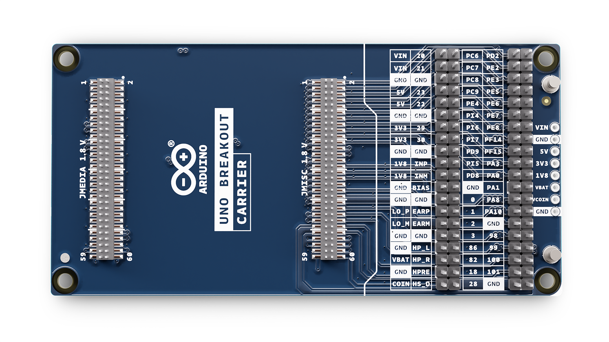

# Description

The Arduino UNO Breakout Carrier is designed to give developers complete, direct access to every signal available on the UNO Q’s JMEDIA and JMISC high-speed connectors. Ideal for advanced prototyping, testing, and integration work, it exposes all lines — including high-speed video, camera, audio, I²C, SPI, UART, PWM, power rails, and control signals — to clearly labeled, easy-to-use breakout headers.

# Features

# Contents
## The Board
### Application Examples
This product is designed to work alongside the Portenta family. Please check the Getting Started guide of your Portenta board.

**Product Development:** The Portenta Breakout board reduces development time for industrial-grade solution automation based on the Portenta line.

**Technical Education:** The Portenta Breakout board can act as a first point of entry for technician education in industrial-grade control and embedded systems.

### Related Products
*   Arduino UNO Q (SKU: ABX00162 - ABX00173)

### Solution Overview

## Ratings
### Absolute Maximum Ratings
| Symbol |             Description             | Min  | Typ  | Max  | Unit |
| :----: | :---------------------------------: | :--: | :--: | :--: | ---- |
|  TMax  |        Maximum thermal limit        | -40  |  20  |  85  | °C   |
| 5VMax  | Maximum input voltage from 5V input | 4.0  |  5   | 5.5  | V    |
|  PMax  |      Maximum Power Consumption      |  -   |  -   | 5000 | mW   |

### Recommended Operating Conditions
| Symbol |         Description         | Min  | Typ  | Max  | Unit |
| :----: | :-------------------------: | :--: | :--: | :--: | :--: |
|   T    | Conservative thermal limits | -15  |  20  |  60  |  °C  |
|   5V   | Input voltage from 5V input | 4.8  |  5   | 5.2  |  V   |

## Functional Overview
### Board Topology
Front view

| **Ref.** |                 **Description**                  | **Ref.** |       **Description**       |
| :------: | :----------------------------------------------: | :------: | :-------------------------: |
|    J1    | DF40HC(3.5)-80DS-0.4V(51) High Density connector |    J5    |        Micro SD card        |
|    J2    | DF40HC(3.5)-80DS-0.4V(51) High Density connector |    J6    | 20 mm coin battery retainer |
|    J3    |               USB type A connector               |    J7    |      Ethernet adaptor       |
|    J4    |               <!--OpenMV-->Cam connector               |    J8    |    Power terminal block     |
|   SW1    |               Boot mode selection                |   PB1    |       Power ON button       |
|    U1    |               USBA power switch IC               |          |                             |

Back view

| **Ref.** |              **Description**               | **Ref.** |              **Description**               |
| :------: | :----------------------------------------: | :------: | :----------------------------------------: |
|   J15    | DF40C-80DP-0.4V(51) High Density connector |   J16    | DF40C-80DP-0.4V(51) High Density connector |

## Connector Pinouts
The Portenta Breakout Board provides easy access to the pins on the high-density connector of the Portenta family. The Portenta Breakout Board is shipped in a headerless configuration to provide flexibility in using 2.54mm compatible connectors to meet their specific application.

In cases where multiple channels are on a single header, the first channel is on the bottom part of the header and the section channel is on the top part of the header. The order of the channel is determined by the silkscreen markings.

### GPIO
| Pin  | **Function** | **Type** | **Description**  |
| :--: | :----------: | :------: | :--------------: |
|  1   |     3V3      |  Power   | +3.3V power rail |
|  2   |    GPIO 0    | Digital  |      GPIO 0      |
|  3   |    GPIO 1    | Digital  |      GPIO 1      |
|  4   |    GPIO 2    | Digital  |      GPIO 2      |
|  5   |    GPIO 3    | Digital  |      GPIO 3      |
|  6   |    GPIO 4    | Digital  |      GPIO 4      |
|  7   |    GPIO 5    | Digital  |      GPIO 5      |
|  8   |    GPIO 6    | Digital  |      GPIO 6      |
|  9   |     GND      |  Power   |      Ground      |
|  10  |     GND      |  Power   |      Ground      |

## Mechanical Information
### Board Outline

## Company Information
| Company name    | Arduino S.r.l.                               |
| --------------- | -------------------------------------------- |
| Company Address | Via Andrea Appiani, 25 - 20900 MONZA (Italy) |

## Reference Documentation
|          **Ref**          | **Link**                                                     |
| :-----------------------: | ------------------------------------------------------------ |
|   Arduino IDE (Desktop)   | https://www.arduino.cc/en/Main/Software                      |
|    Arduino IDE (Cloud)    | https://create.arduino.cc/editor                             |
| Cloud IDE Getting Started | https://create.arduino.cc/projecthub/Arduino_Genuino/getting-started-with-arduino-web-editor-4b3e4a |
|    Arduino Pro Website    | https://www.arduino.cc/pro                                   |
|        Project Hub        | https://create.arduino.cc/projecthub?by=part&part_id=11332&sort=trending |
|     Library Reference     | https://www.arduino.cc/reference/en/                         |
|       Online Store        | https://store.arduino.cc/                                    |

## Change Log
| **Date**   | **Revision** | **Changes**                                 |
|------------|--------------|---------------------------------------------|
| 04/03/2026 | 1            | First Release                               |